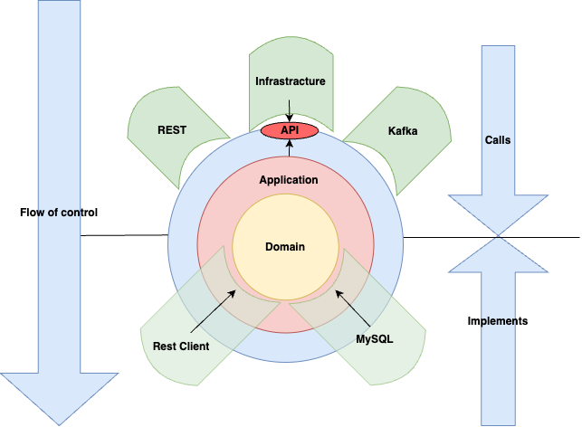

# Introduction
Upon recently re-reading `Clean Architecture` by Robert C. Martin I went through whole Part III where different
design principles are discussed. Although I found all of them interestingly described when it comes to applicability
in wider scope than usually they are discussed (mostly SOLID principles), I believe author put a lot of attention to
one specific principle which stands for "D" in SOLID and is described as "Dependency Inversion Principle" (DIP).

Let's look at the standard definition of it:
> High-level modules should not depend on low-level modules. Both should depend on abstractions.

To simply put it, DIP encourages the use of abstractions (interfaces or abstract classes) to decouple high-level
and low-level components in a system, promoting a more flexible and extensible architecture.

# Problem statement
Before jumping into the application of Dependency Inversion in practice, let's first define the problem we would like
to solve. One of the many forms we can observe violation of DIP is when we tightly couple high-level and low-level
components, making impossible to change one without affecting the other.

Below we can observe direct `DIP` violation:

```kotlin
class BillingService {
    private val processor = PayPalPaymentProcessor()

    fun charge() {
        processor.process()
    }
}

class PayPalPaymentProcessor {
    fun process() {
        println("Processing PayPal payment")
    }
}
```

What went wrong here? The `BillingService` (high-level) class is tightly coupled to the `PayPalPaymentProcessor`
(low-level) class. High-level component depends on a concrete implementation of low-level component, every change
in `PayPalPaymentProcessor` will directly affect necessity of changes in `BillingService` class. Such structure 
not only makes future changes difficult but also makes testing harder. Can we do better? Yes, we can.

Above example can be illustrated with a simple dependency graph:


## Solution

```kotlin
class BillingService(private val processor: PaymentProcessor) {
    
    fun charge() {
        processor.process()
    }
}

interface PaymentProcessor {
    fun process()
}

class PayPalPaymentProcessor: PaymentProcessor {
    fun process() {
        println("Processing PayPal payment")
    }
}
```

What just happened here? We introduced an interface `PaymentProcessor` which is implemented by `PayPalPaymentProcessor` 
class. We also changed `BillingService` class to accept `PaymentProcessor` as a constructor parameter. This way,
we not only applied directly `DIP` but also using technique called Dependency Injection we enabled the possibility to
inject different implementations and interchangeability of `PaymentProcessor` implementation. Now, `BillingService`
class is not dependent on a concrete implementation, it's dependent on an abstraction (interface), the same applies
to `PayPalPaymentProcessor` class which by implementing `PaymentProcessor` interface is not dependent
on `BillingService` class.

After applying above changes, we can see that direction of our dependency graph has changed. Illustration below shows
that both (low and high-level) components point to the abstraction (interface) instead of pointing to each other.


# Architecture and DIP

The example provided above may not offer groundbreaking insights to many of us. Using interfaces as abstractions
to decouple high-level and low-level components is a common practice. However, the real challenge arises when
attempting to apply the Dependency Inversion Principle (DIP) to higher-level concepts such as architecture.
In his book 'Clean Architecture,' Robert C. Martin describes how the application of DIP can lead to the creation
of more flexible and maintainable architecture. This is achieved by placing low-level infrastructure components
behind a fine line of abstractions, thus keeping the core business logic independent of any external frameworks
or libraries.

This particular approach to designing the architecture of our systems can be found in various sources under different
names, such as `Ports and Adapters`, `Hexagonal Architecture`, and `Clean Architecture`. The underlying idea behind
all of these approaches remains consistent: to keep the core business logic as the primary focus of the service,
free from unnecessary entanglement with external dependencies.

This architectural style applies the Dependency Inversion Principle as an additional restriction on the
multiple layers of an application. As a result, all dependencies point towards the center, where the high-level
policy logic should reside. Therefore, the center is where we hope to find the domain model, the core functionality
of the application. Achieving `DIP` in a layered architecture is done by creating abstract interfaces for the low-level
details. These low-level details are typically referred to as adapters and sit at the boundary of your system.
The abstractions are called ports and are part of the domain layer.



# Conclusions