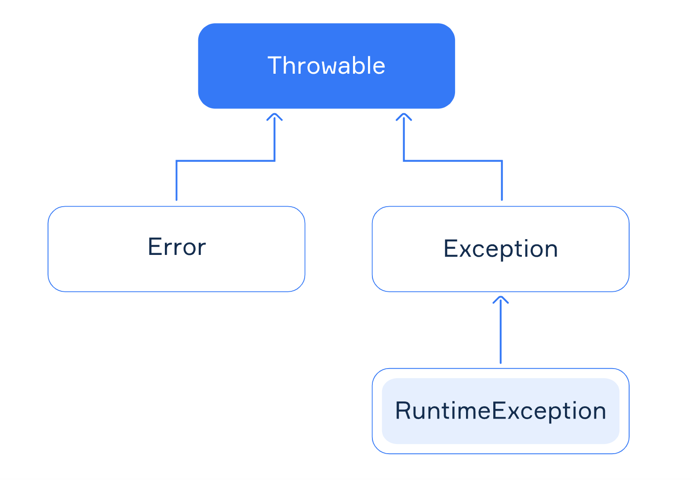

# Foreword

Most of us are dealing with exceptions on a daily basis, and probably almost everyone at some point faced the 
situation where for some reason the application crashed, and you could not point exactly where and why. Exceptions
are powerful tool to express erroneous behaviour, but usually the problem lies in how we handle them. Developers
tend to follow `catch them all` pattern, which usually leads to losing the context of an error. There is probably even
more common mistake we all commit, by leaving some exceptions unhandled. Today I would like to show you the different
approach to dealing with errors and how it can make your life easier (I hope), the Functional way.

**Table of content:**
- [Introduction](#introduction)
- [Understanding Exceptions: The Traditional Route](#understanding-exceptions-the-traditional-route)
- [Embracing the Functional Approach](#embracing-the-functional-approach)
- [Why Functional Beats Exceptions](#why-functional-beats-exceptions)
- [Transitioning to Functional: A Step-by-Step Guide](#transitioning-to-functional-a-step-by-step-guide)
  - [Kotlin Standard Library](#kotlin-standard-library)
  - [Arrow Library](#arrow-library)
    - [Option Type](#option-type)
    - [Either Type](#either-type)
- [Real-World Example](#real-world-example)
  - [Domain](#domain-model)
  - [Errors](#domain-errors)
  - [Infrastructure](#infrastructure-layer-repository)
  - [Rest API](#rest-api-layer)
- [Conclusion](#conclusion)

# Introduction
Ever faced a situation where an unexpected error crashed your application, leaving you wondering what 
went wrong? 🕵️‍♂️ Traditional exception handling often leads us down this path because of its not deterministic nature
when it comes to the execution order. But what if there's a better way? Functional approach to error handling is
a method that promises not only to solve these headaches but also to streamline your code into something more elegant
and robust.

# Understanding Exceptions: The Traditional Route
Exception handling is like that safety net at the circus. It catches you when you fall - but sometimes, it can be a
bit too late. Exceptions disrupt the normal flow of your program, making it hard to understand and predict. They're like
the plot twists in your favorite series - exciting but sometimes unnecessary. 

As the main language of consideration we will use `Kotlin`. In `Kotlin` when we want to signal exceptional behaviour
we use `throw` keyword, as opposed to returning them as values. Such approach not only breaks the structured 
programming principles but as well introduces additional complexity (`cognitive overload`) since as developers
we are not aware by reading method signature how the method behaves. What's more, as opposed to `Java`, `Kotlin`
does not have `checked exceptions` implemented, all `Kotlin's` exceptions are unchecked
[checked exceptions](https://kotlinlang.org/docs/exceptions.html#checked-exceptions). Let's take a look at the example:

```kotlin 
data class Payment(val paymentId: PaymentId, val amount: Amount, val from: Account, val to: Account)

@JvmInline
value class PaymentId(val value: Int)

@JvmInline
value class Amount(private val value: BigDecimal) {
    operator fun compareTo(other: Amount): Int = value.compareTo(other.value)
}

@JvmInline
value class Account(val value: String)

interface PaymentsRepository {
    fun findById(paymentId: PaymentId): Payment
}

class PaymentInMemoryRepository: PaymentsRepository {
    private val payments = mapOf(
        PaymentId(1) to Payment(PaymentId(1), Amount(BigDecimal.ZERO), Account("A"), Account("B")),
        PaymentId(2) to Payment(PaymentId(2), Amount(BigDecimal.ONE), Account("A"), Account("B")),
        PaymentId(3) to Payment(PaymentId(3), Amount(BigDecimal.TEN), Account("A"), Account("B"))
    )

    override fun findById(paymentId: PaymentId): Payment {
        val payment = payments[paymentId]

        if(payment != null) {
            return payment
        } else {
            throw NoSuchElementException("Payment not found")
        }
    }
}

fun main() {
    val paymentRepository = PaymentInMemoryRepository()
    val payment = paymentRepository.findById(PaymentId(10))
}
```

What's wrong with the above code? The `PaymentInMemoryRepository` class throws an exception when the payment is not
found and compiler does not enforce us to handle such case or even communicate such situatuin:
```shell
Exception in thread "main" java.util.NoSuchElementException: Payment not found
	at PaymentInMemoryRepository.findById-vw4yWFA(Main.kt:34)
	at MainKt.main(Main.kt:41)
	at MainKt.main(Main.kt)
```

This is a typical example of how exceptions can lead to unhandled errors. What's more, when looking at method:
```kotlin
fun findById(paymentId: PaymentId): Payment
```
we cannot tell by its signature that it may throw an exception, we need to look at the implementation to find
out it can yield `NoSuchElementException` exception.

Let's take a look how we can take advantage of `typed errors` and `functional programming` to solve this problem.

# Embracing the Functional Approach
The functional approach to error handling is like having a GPS that not only shows you the roadblocks but also the
best way around them. It involves using specific data types (like `Option`, `Either`) to represent success
or failure, integrating error handling into the flow of the program rather than disrupting it. In that way, we
enforce the compiler to check all possible error paths, making our code more predictable and safe. Also for developers
it's easier to understand the method signature and its behaviour based on it.

# Why Functional Beats Exceptions

- Functional error handling makes your application's behavior more predictable and its state more manageable.
- Functional patterns can be easily combined, leading to cleaner and more modular code.
- It allows you to handle errors locally or propagate them without throwing exceptions, keeping the control flow intact
- Performance-wise, functional error handling is more efficient than exceptions, as it doesn't require the creation of
  stack traces (in most cases)

# Transitioning to Functional: A Step-by-Step Guide

Let's take a look at how we can transition from traditional exception handling to the functional approach. There are
many already defined libraries that can help us with that, but for the purpose of this article we will look into two:
`Kotlin Standard Library` and `Arrow`.

## Kotlin Standard Library
Kotlin standard library already comes with `Result` type that we can use to represent success or failure result
of processing. Let's take a look at the example:

```kotlin 
fun main() {
    val success = Result.success("Hello")
    val failure = Result.failure<String>(RuntimeException("Something went wrong"))

    val result = runCatching {
        failure
    }.onSuccess {
        println("Success: $it")
    }.onFailure {
        println("Failure: $it")
    }
}
```

We can see that `Result` type is a wrapper around the value that can be either success or failure. Here additionally we
can see that `runCatching` function is used to catch the exception and wrap it into `Result` type. There is although a 
very big downside to using `runCatching`, it's that it catches all exceptions (subclasses of `Throwable` so 
as well `OutOfMemoryError`) under the hood. 



There is usually almost nothing you can do with such JVM errors (even reporting them might be impossible,
for instance in case of `OOME`). According to the Java documentation, the Error class
"indicates serious problems that a reasonable application should not try to catch". There are some very special
cases where you might want to try to recover from error, but that is quite exceptional (pun intended).

Catch-all mechanisms like this (even `catch(Exception)`) are usually not recommended unless you're implementing 
some kind of framework that needs to attempt to report errors in some way.

Let's look how we can mitigate this problem using `Arrow` library.

## Arrow Library
Arrow is a library for Typed Functional Programming in Kotlin. It comes with a lot of useful data types and functions
which are not only useful for error handling but as well for building more predictable and maintainable code. Author's
statement:

> Arrow aims to bring idiomatic functional programming to Kotlin. This means Arrow is inspired by the great work made in other functional programming communities, yet exposes these ideas and concepts in ways that do not feel alien to Kotlin programmers. 
> Arrow comprises different libraries, each improving or extending one commonly-used library in the Kotlin ecosystem or a particular Kotlin language feature.

Today we will focus on the `core` part of library, which comes with predefined types like `Option`, `Either` to help us
harness the power of functional programming along with type safety when handling errors.

Quick setup in our gradle project:
```kotlin
implementation("io.arrow-kt:arrow-core:1.2.2")
```

and we can start exploring.

### Option Type
We will start our exploration with `Option` type. `Option` type is a container for an optional value. It can have either
value of type `Some` or `None`. It's a great way to represent the absence of a value. As we know `Kotlin` already comes
with `null` to represent the absence of a value, but `Option` type is more explicit and safe way to represent such case.

Lets take a look at the example:
```kotlin
inline fun <T> nullable(f: () -> T): T? = try {
  f()
} catch (e: NoSuchElementException) {
  null
}

fun main() {
  val paymentsRepository = PaymentInMemoryRepository()
  val payment = nullable { paymentsRepository.findById(PaymentId(5)) }
  println(payment)
}
```

The result would be: `null`. We can see that `nullable` function is used to catch the exception and return `null` 
as the result. This approach is not entirely pretty, it introduces a necessity to use `nullable` function at each 
call site where we expect exception `NoSuchElementException` to be thrown. Also it does not change the method signature
and the way implementation hides the fact that it may throw an exception. 

Let's take a look how we can solve this problem with `Option` type from `Arrow` library.

```kotlin
// Arrow library
sealed class Option<out A> {
  data class Some<out T>(val value: T) : Option<T>()
  object None : Option<Nothing>()
}
```

As we can see it introduces two subtypes: `Some` and `None`. `Some` is used to represent the presence of a value, and
`None` is used to represent absence of it. Now value `null` is strongly typed. Let's refactor above example to take
advantage of `Option` type:

```kotlin
fun main() {
  val paymentsRepository = PaymentInMemoryRepository()
  val payment = Option.catch { paymentsRepository.findById(PaymentId(5)) }

  payment.fold(
    ifEmpty = { println("Payment not found") },
    ifSome = { println("Payment found") }
  )
}
```

Here, we’re using the `Option.catch` builder function that ships along Option‘s companion object. Option‘s catch
already distinguishes fatal from recoverable exceptions, so we don’t have to roll out a builder function on our own.
We can use `fold` function to handle both  scenarios when the value is present and when it's not. What's more now we
are forced by compiler to explicitly handle both cases, making our code more predictable and safe.

Few more interesting functions that `Option` type comes with:

```kotlin
// Transforms T? into Option<T>
val payment = Option.ofNullable(paymentsRepository.findById(PaymentId(5)))

// null -> Option.None
null.toOption()

// T - > Option.Some<T>
"value".some()
```

### Either Type
Either is a functional type that represents a value out of two possible data types. By convention, these types are
called the `left type` and `right type`, with the `left` one representing the exceptional (erroneous) result.

Let's look on how Either is defined:
```kotlin
// Arrow Library
sealed class Either<out A, out B> {
    data class Left<out A> constructor(val value: A) : Either<A, Nothing>()
    data class Right<out B> constructor(val value: B) : Either<Nothing, B>()
}
```

The Either type is a `sealed class` which forces the compiler to check if all the possible cases (its instances)
are handled when applying pattern matching using `when` expression. Let's define our error structure which we could use
to represent errors in our example:

```kotlin
sealed class PaymentError {
    data class PaymentNotFound(val id: PaymentId): PaymentError()
    data class InvalidAmount(val amount: Amount): PaymentError()
    data object UnknownError: PaymentError()
}
```

Let's see how we can create instances of `Either`:
```kotlin
val payment = Payment(PaymentId(1), Amount(BigDecimal.ZERO), Account("A"), Account("B"))
// Either<Nothing, Payment>
val success = Either.Right(payment)
// Either<PaymentNotFound, Nothing>
val failure = Either.Left(PaymentNotFound(PaymentId(1)))
```

Like we established before since `Either` is a `sealed class` we can apply pattern matching to check the result of
payment retrieval:
```kotlin
fun processPayment(payment: Either<PaymentError, Payment>) = when(payment) {
  is Either.Left -> println("Error: $error")
  is Either.Right -> println("Payment: $payment")
}
```

`Either` type comes with many different functions delivered by Arrow, which help us to apply different transformations
on its instance. Let's take a look at some of them:

```kotlin
val payment = Payment(PaymentId(1), Amount(BigDecimal.ZERO), Account("A"), Account("B"))

// Map over the right side of Either, Either<Nothing, Payment> -> Either<Nothing, Amount>
val result = Either.Right(payment).map { it.amount }

// Map over the left side of Either, Either<InvalidAmount, Nothing> -> Either<UnknownError, Nothing>
val result = Either.Left(InvalidAmount(Amount(BigDecimal.ZERO))).mapLeft { UnknownError }

// Fold over the right side of Either, Either<Nothing, Payment> -> Payment
val result = Either.Right(payment).fold(
  ifLeft = { UnknownError },
  ifRight = { it }
)

// Bridge exceptional code to Either, throws NoSuchElementException -> Either<PaymentError, Payment>
val result = Either.catch { 
  paymentsRepository.findById(PaymentId(5)) 
}.mapLeft { 
  when(it) {
    is NoSuchElementException -> PaymentNotFound(PaymentId(5)) 
    else -> UnknownError
  }
}
```

The possibilities are endless, for the detailed overview of `Either` type and its functions please refer to the link
[Either](https://apidocs.arrow-kt.io/arrow-core/arrow.core/-either/index.html).

# Real-World Example

Now, when we have a brief overview of functional error handling using typed errors and `Arrow` library, let's take
a look at how we could implement a simple RESTful API to retrieve payment by its id (based on code from the beginning).

### Domain model

We define simple domain model representing payment:
```kotlin
data class Payment(val paymentId: PaymentId, val amount: Amount, val from: Account, val to: Account)

@JvmInline
value class PaymentId(val value: Int)

@JvmInline
value class Amount(private val value: BigDecimal) {
    operator fun compareTo(other: Amount): Int = value.compareTo(other.value)
}

@JvmInline
value class Account(val value: String)
```

### Domain errors:

In order to properly represent errors our `business logic` may yield we define hierarchy of possible errors within
our `domain`:
```kotlin
sealed class PaymentError {
    data class PaymentNotFound(val id: PaymentId): PaymentError()
    data class InvalidAmount(val amount: Amount): PaymentError()
    data class InvalidAccount(val account: Account): PaymentError()
}
```
With such approach whenever we encounter error which we expect (recoverable) we can represent it using `PaymentError`
or one of its subtypes.

### Infrastructure layer (repository):

We define simple interface which later we will use directly to access our in memory storage, nothing fancy:
```kotlin
data class PaymentRecord(val paymentId: Int, val amount: BigDecimal, val from: String, val to: String)

interface PaymentsFinder {
    fun findById(paymentId: PaymentId): Either<PaymentNotFound, Payment>
}

class PaymentInMemoryFinder: PaymentsFinder {
    private val payments = mapOf(
        1 to PaymentRecord(1, BigDecimal.ZERO, "A", "B"),
        2 to PaymentRecord(2, BigDecimal.ONE, "A", "B"),
        3 to PaymentRecord(3, BigDecimal.TEN, "A", "B")
    )

  override fun findById(paymentId: PaymentId): Either<PaymentNotFound, Payment> = either {
    val payment = payments[paymentId.value]
    ensureNotNull(payment) {
      PaymentNotFound(paymentId)
    }
    payment.toDomain()
  }
  
    private fun PaymentRecord.toDomain(): Payment = Payment(PaymentId(paymentId), Amount(amount), Account(from), Account(to))
}
```

The most tricky part here is the `findById` method. We use `either` builder function to create an instance of `Either`.
It is a dedicated DSL to simplify the composition of Either instances. Similarly, we have access to the `ensureNotNull`
extension function, which `short-circuits` (returns result without further method execution) the computation if a `null`
value is found.

### Rest API layer:

The last part of our application is the `Rest API` layer. We will use `Ktor` library to define simple RESTful API. 
For the simplicity of the example we will directly use our `PaymentsInMemoryFinder` to directly access our in memory
storage (in real world scenario we would use `Dependency Injection` to inject the `PaymentsFinder` into our `Rest API`).

```kotlin
val paymentsFinder = PaymentInMemoryFinder()

routing {   
  get("/payments/{id?}") {
    val id = call.parameters["id"] ?: return@get call.respondText(
      "Missing payment id",
      status = HttpStatusCode.BadRequest
    )
    
    paymentsFinder
      .findById(PaymentId(id))
      .map { it.toResponse() }
      .respond(HttpStatusCode.OK)
  }
}

data class SinglePaymentResponse(val id: Int, val amount: BigDecimal)

fun Payment.toResponse() = SinglePaymentResponse(
  id = id.value,
  amount = amount.value
)

context(PipelineContext<Unit, ApplicationCall>) 
suspend inline fun <reified A : Any> Either<PaymentError, A>.respond(
  status: HttpStatusCode
): Unit =
  when (this) {
    is Either.Left -> respondError(value)
    is Either.Right -> call.respond(status, value)
  }

private suspend fun PipelineContext<Unit, ApplicationCall>.respondError(error: PaymentError): Unit =
  when (error) {
    is InvalidAmount, InvalidAccount -> call.respond(HttpStatusCode.BadRequest)
    is PaymentNotFound -> call.respond(HttpStatusCode.NotFound)
    is UnknownError -> call.respond(HttpStatusCode.InternalServerError)
  }
```
There are few interesting things happening here. First of all we defined `respond` extension function which is used to
based on the result of `Either` instance respond with proper status code. What's more we defined `respondError` 
function which having directly information of expected error which makes compiler to enforce us to handle all possible
errors. You may ask yourself, wait, where is *Global Exception Handler*, all mighty interceptor which catches whatever
error we have not handled? When it comes to our `business logic` and `errors` we expect, we no longer need it. Of course
there might be some `unrecoverable` like `OutOfMemoryException` exception which we might want to handle globally,
but it should not be not part of our `business logic`.

# Conclusion
We came quite a long way from traditional exception handling to the functional approach. Undoubtedly, the functional
approach to error handling using typed errors requires a bit of a learning curve which can be quite steep at the beginning.
It is not my position neither of this article to say that one approach is better than the other, I tend to believe that
sometimes simple solutions are not worth the additional complexity which this approach brings. Like old saying says:
  > Using a sledgehammer to crack a nut

Although, in the systems where we can in clear and expresive way represent our `business logic` and `errors` we expect,
such style of programming can bring a lot of benefits. It makes our code more predictable, safe and maintainable. The
code at hand is easier to reason about, and enables compiler to do its job as best as it can, protect us `developers`
from hurting ourselves.