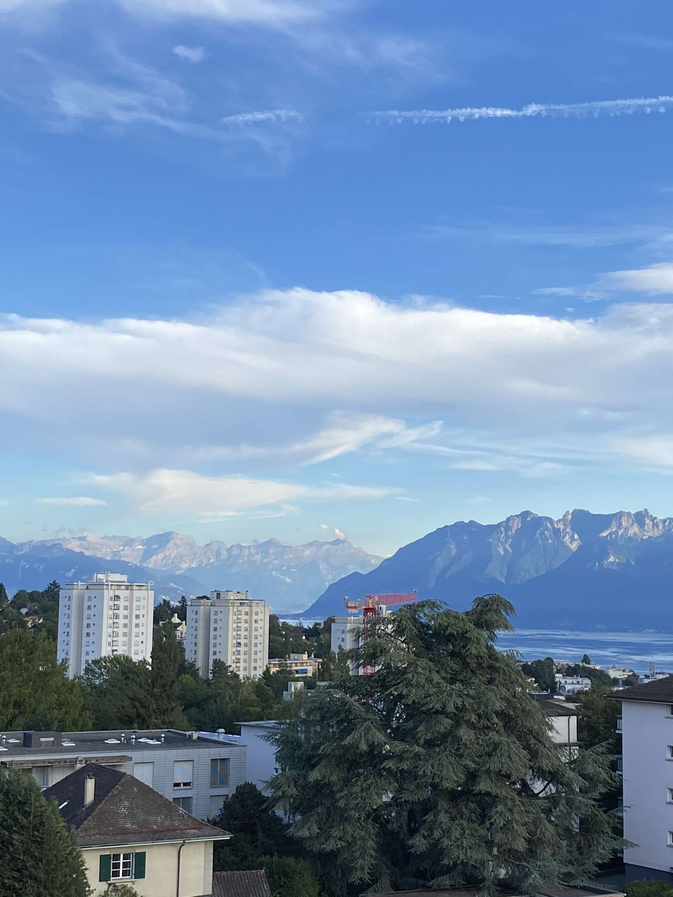

After 7 years as a Software Engineer, I always tried to pursue every opportunity to the fullest.

## Result?

I constantly felt like I was missing out, always feeling behind my peers, and never allowing myself to take a moment to
enjoy time outside of work.

## Breaking the Vicious Cycle

It was simple but radical. I left my computer, logged out of all work-related social media, and headed to Switzerland.

## Feeling?

Amazing. Seven years without a proper holiday did me no good. Constantly stressing about procrastination and not pushing
harder clearly left a mark. After just 9 days away, I feel so much better and excited to return to work—which I’m lucky
to call my hobby.

## Conclusion

Disconnecting isn't easy, and remote work setups make it even harder for many. I'm not claiming to have found the 
perfect solution, but here are some tips that have worked for me:

💫 **Take breaks:** It's important to spend time proportionally in and out of the working environment.

💫 **Focus on your strengths:** You are worthy! Don’t constantly compare yourself to others.

💫 **Be selective:** Develop skills and practice things you believe will bring long-lasting value. It’s impossible and
unnecessary to learn everything.

💫 **Set realistic expectations:** Don’t expect to be an expert in everything. It’s okay not to know everything.
