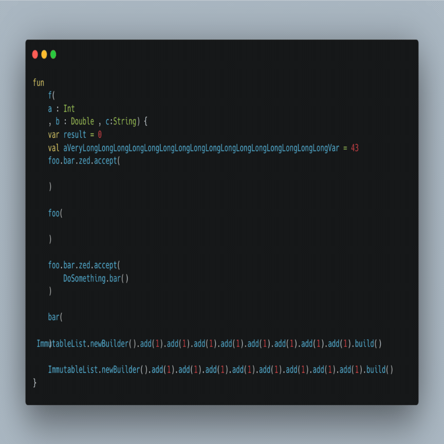
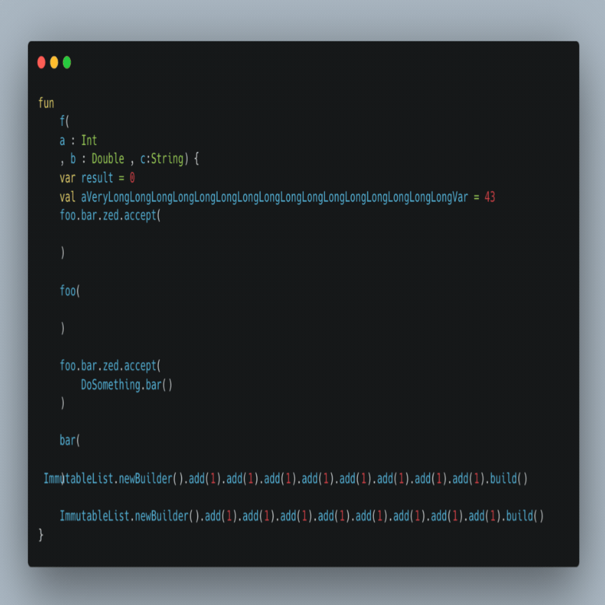
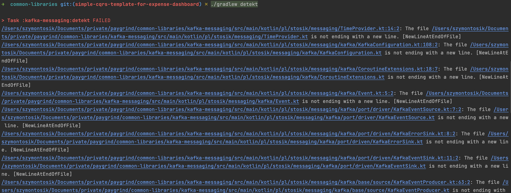
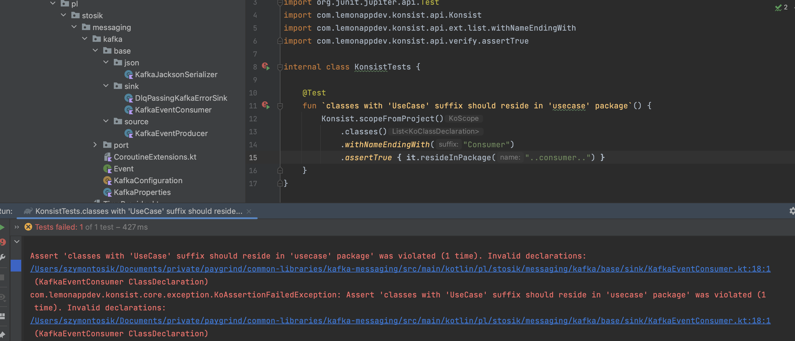

# Introduction
How many times you saw a Pull Request with hundreds of lines changed only because other
developer on the team had differently configured formatting in his IDE? How many times you had to
scratch your hear around what is actual value from given pull request and what is just reformatting
spacing from four spaces to tab? We have all been there, an apparently simple problem which should be
solved once, so we could focus on bringing actual business value often transforms into never ending
back and forth battle on how, when and if formatting and syntax validation should be part of automation
and once for all forgotten.

# Problem statement
Code formatting is simple, it does not require high technical skills to master but often is neglected
by many because of seemingly low return of investment. Is that really the case? When reading code for many
hours a day it seems like having it formatted in the way books are, seems like a must-have. And yet, when
reading code from hundreds of repositories it can be noticed each of them have different style of formatting.
The fact is, we spend 60-70% of our time reading code, the rest mostly on writing, which suggests that it should
be our top one priority to make it right, and make it smooth.

# But why?

## Studies

1. **Improved Readability & Reduced Cognitive Load**:
   - Well-formatted code improves readability, making it easier for developers to understand and reducing cognitive 
    effort. Consistent code structures like indentation and spacing significantly enhance comprehension. [Code Styling and its Effects on Code Readability and Interpretation](https://www.diva-portal.org/smash/get/diva2:1112978/FULLTEXT01.pdf)


2. **Code Complexity & Maintainability**:
    - Increased code complexity can hurt readability, but proper formatting mitigates this, ensuring that even complex
   code remains manageable. Automated tools that enforce formatting boost long-term maintainability.


3. **Effectiveness of Automated Tools**:
    - Tools like linters and formatters ensure code consistency, making collaboration easier and reducing the need 
    for manual intervention during code reviews.
   [On the Importance and Shortcomings of Code Readability Metrics: A Case Study on Reactive Programming](https://ar5iv.labs.arxiv.org/html/2110.15246) 

## The right direction

### Readability and Maintainability
- Well-styled code is easier to understand for both current developers and future contributors.
- Small details like consistent indentation, clear naming conventions, and proper spacing help developers quickly grasp the logic.

### Minimizing Cognitive Load
- Consistent code styles reduce the mental effort required to switch between different parts of the codebase.
- Developers can focus on solving problems rather than interpreting varied code formats.

### Collaboration and Teamwork
- Enforcing consistent style ensures all developers adhere to the same standards, reducing friction in code reviews and pair programming.
- It creates a common language that everyone on the team understands, leading to smoother development workflows.

### Future Development
- Consistent code prevents the accumulation of technical debt, making the codebase easier to refactor or extend in the future.
- Well-structured code facilitates on-boarding new team members and enables them to contribute faster.

# Bad and good formatting

It does not take much to distinguish a good code from bad code styling-wise, once we have seen few projects and spend
some time working on our own code. But let's look quickly for a short example so we could have a reference for further
reasoning.

## Badly formatted code

```kotlin
data class Person(var name:String="",var age:Int=0){
fun printInfo(){
if(name!=""){
println("Name: "+name+", Age: "+age)
}else{println("Name not provided")}
}
fun updateAge(newAge:Int){if(newAge>0){age=newAge}else{println("Invalid age")}}
}
```

## Well formatted code

```kotlin
data class Person(var name: String = "", var age: Int = 0) {

    fun printInfo() {
        if (name.isNotEmpty()) {
            println("Name: $name, Age: $age")
        } else {
            println("Name not provided")
        }
    }

    fun updateAge(newAge: Int) {
        if (newAge > 0) {
            age = newAge
        } else {
            println("Invalid age")
        }
    }
}
```

# Kotlin

For the sake of this article I will focus on specific code styling and tooling which can be utilized to improve code 
formatting and everything what comes with it. Although I hope that presented techniques and patterns may be applicable 
across different languages.

## Key aspects

#### Indentation and Formatting
- Proper indentation improves code structure and makes it easier to understand, especially in nested blocks. 
In Kotlin, this is crucial for avoiding deep nesting and keeping code readable.

#### Naming Conventions
- Use **camelCase** for variables and functions, and **PascalCase** for class names. Meaningful, descriptive names
reduce ambiguity and make the code more self-explanatory.

#### Line Length and Wrapping
- Keep line lengths reasonable (80-120 characters) for better readability. Use line wrapping to prevent horizontal
scrolling in code editors.

#### Code Comments and Documentation
- Keep comments concise but meaningful. In Kotlin, use KDoc for clear documentation, especially in public-facing APIs.

#### Functional vs. Object-Oriented Design
- Kotlin allows a mix of functional and object-oriented styles. When adopting a particular paradigm, ensure consistency
in code structure to avoid confusion for future contributors.

## Set of tools
We will inspect multiple tools which can greatly improve ours day to day life by simply autoformatting our code
to a specific (preconfigured) desired format. Each of them differs in its functionalities and under the hood 
implementation, but let's keep the judgement for summary section. 

### ktlint
ktlint, developed by Pinterest, is a powerful tool for enforcing consistent code style in Kotlin projects. Think of it as a strict yet helpful mentor focused on ensuring uniformity in your code.

#### Why ktlint Stands Out:
- **Customizable Styles**: Configure your own formatting preferences using a `.editorconfig` file.
- **Precise Enforcement**: Detect and correct formatting issues to maintain clean and consistent code.
- **Flexible Integration**: Run ktlint on-demand, integrate it into your IDE, or automate it with your CI/CD pipeline.

#### Integrating Ktlint in a Kotlin Gradle Project
To set up ktlint in your Gradle project, add the following to the `build.gradle.kts` file:

```kotlin
plugins {
    id("org.jlleitschuh.gradle.ktlint") version "<current_version>" apply false
}

subprojects {
    apply(plugin = "org.jlleitschuh.gradle.ktlint")
    configure<org.jlleitschuh.gradle.ktlint.KtlintExtension> {
        debug.set(true)
    }
}
```

#### Customization with `.editorconfig`
While ktlint comes with default formatting rules, you can further tailor the code style by using a `.editorconfig` file. This allows you to enforce specific coding preferences. An example configuration might look like this:

```yaml
[*.{kt,kts}]
max_line_length = 120    # Enforce a max line length of 120 characters
indent_size = 4          # Use 4 spaces for indentation
```

#### Gradle Tasks
With ktlint set up, you can use the following Gradle tasks to enforce and apply consistent code styling:

```bash
./gradlew ktlintCheck // This task checks your code for formatting violations without making any changes.
./gradlew ktlintFormat: // This task automatically formats your code according to the rules specified in the .editorconfig file.
```

#### IDE (plugin)

1. Install the ktlint Plugin: You can find the ktlint plugin in IntelliJ IDEA’s plugin marketplace. Install it through 
`Settings > Plugins > Marketplace > Search` for "ktlint".
2. Automatic Formatting: After installation, ktlint can automatically format your code when saving or using
`Code > Reformat Code (Ctrl + Alt + L)`. You can configure ktlint using a .editorconfig file to customize rules like
indentation, max line length, etc.

Below we can see ktlint in action:



### ktfmt

ktfmt, developed by Facebook (Meta), is a highly opinionated Kotlin formatter. Unlike other tools that allow customization,
ktfmt adheres to a strict set of predefined rules, ensuring that all code follows the same formatting style.

Think of ktfmt as an artist who takes your code and turns it into a clean, consistently formatted masterpiece, 
regardless of how it starts.

#### Why ktfmt is special:
- **Deterministic Results**: No matter how messy your code, ktfmt always produces the same output. You can count on a
predictable, uniform format every time.
- **Focus on Code, Not Formatting**: By handling all the formatting for you, ktfmt frees you up to concentrate on the
logic and functionality of your code.
- **Simplicity**: Ktfmt is easy to use—no complex configurations. It works out of the box with a single, well-defined style.

While ktfmt’s "one size fits all" approach may not suit everyone, it’s perfect for those who prioritize simplicity
and consistent results over extensive control. For developers seeking more customization, tools like ktlint may be a
better fit.

### Integrating Ktfmt in a Kotlin Gradle Project

To integrate ktfmt into your Gradle project, add the following to your `build.gradle.kts` file:

```kotlin
plugins {
    id("com.ncorti.ktfmt.gradle") version "<current_version>" apply false
}

subprojects {
    apply(plugin = "com.ncorti.ktfmt.gradle")

    configure<com.ncorti.ktfmt.gradle.KtfmtExtension> {
        kotlinLangStyle()
    }
}
```

#### Gradle Tasks
Once integrated, you can use these Gradle tasks to enforce consistent formatting:

```bash
./gradlew ktfmtCheck: Checks your code for formatting violations but does not modify it.
./gradlew ktfmtFormat: Automatically formats your code in a deterministic way, ensuring uniformity across your entire project.
```

Below we can see ktfmt in action:




### Spotless + ktfmt

Probably after reading the `kftmt` section you scratch your head and think, well that's quite a nice tool but what if I
want a little more flexibility. Nothing is always set in stone, right? Well, with the help comes already battle tested
tool called `spotless`. As spotless authors describe it:

> Ideally, a code formatter can do more than just find formatting errors - it should fix them as well. 
> Such a formatter is just a Function<String, String>, which returns a formatted version of its potentially unformatted input.

And that's exactly what `spotless` does, it integrates multiple formatting functions in form of `FormatterStep` which based
on given input, produce desired outputs. `Spotless` is multiplatform, it integrates well over 30 different formatters.
When it comes to Kotlin, we can use already mentioned `ktlint` or `ktfmt`as such functions. What is more interesting,
especially given combining it with `ktfmt` is that now we have more flexibility in its configuration.

### Integrating Spotless + Ktfmt in a Kotlin Gradle Project

To integrate Spotless with ktfmt into your Gradle project, add the following to your `build.gradle.kts` file:

```kotlin
plugins {
    id("com.diffplug.spotless") version "<current_version>"
}

configure<com.diffplug.gradle.spotless.SpotlessExtension> {
    kotlin { ktfmt("0.46").dropboxStyle() }
    kotlinGradle {
        target("*.gradle.kts")
        ktfmt("0.46").dropboxStyle()
    }
}
```

#### Gradle Tasks
Once integrated, you can use these Gradle tasks to enforce consistent formatting:

```bash
./gradlew spotlessCheck: Checks if the code adheres to the defined formatting rules.
./gradlew spotlessApply: Automatically formats your code according to the specified rules.
```

### Detekt

**Detekt** is a powerful static code analysis tool for Kotlin. It helps identify code smells, complexity, style
violations, and potential bugs in your Kotlin codebase. It serves as a valuable addition to your Kotlin project,
ensuring clean, maintainable, and high-quality code.

Detekt offers multiple features, including:
- **Code smell detection**: Highlights problematic code that might lead to future bugs or poor readability.
- **Cyclomatic complexity analysis**: Helps monitor and manage code complexity to maintain simplicity.
- **Customizable rules**: You can extend Detekt’s rules or create your own rules to suit your project's needs.
- **Gradle integration**: Detekt can be easily integrated into Gradle projects, running during build time or CI pipelines.

#### Adding Detekt to a Kotlin Project

To integrate Detekt into your Kotlin project using Gradle, follow these steps:

1. **Add the Detekt plugin**:

   In your `build.gradle.kts` file (root level), add the following plugin:

   ```kotlin
   plugins {
       id("io.gitlab.arturbosch.detekt") version "1.23.1"
   }
   ```
2. **Add the Detekt plugin**:
   ```kotlin
    detekt {
       toolVersion = "1.23.1"  // Specify the Detekt version
       config = files("config/detekt/detekt.yml")  // Optional: Provide a custom configuration file
       buildUponDefaultConfig = true  // Extend default rules
       allRules = false  // Set to true to enable all rules
    }
    ```
3. **Custom Configuration**

   If you want to create custom rules or configure specific behaviors, you can add a `detekt.yml` file in the
   config/detekt directory. Here’s an example of a custom rule configuration:
   ```yaml
    style:
      MagicNumber:
        active: true
        ignoreNumbers: [-1, 0, 1, 2]
   ```
   This configuration will activate the "Magic Number" rule and ignore certain values.

4. **Running Detekt**
   Once set up, you can run Detekt using the following Gradle tasks:
   ```bash
   ./gradlew detekt // Runs Detekt on the project and reports any issues found.
   ./gradlew detektBaseline // Creates a baseline of the current issues, allowing you to track future issues without addressing legacy code.
   ```

Below we can see an example of running first of above commands on a simple project.



#### IDE (plugin)

1. Install the Detekt Plugin: Go to `Settings > Plugins` in IntelliJ, search for "Detekt", and install it.
2. Run Detekt Analysis: Once installed, you can run the analysis via the IntelliJ Run/Debug Configurations or directly
using the Gradle task `./gradlew detekt`. The Detekt plugin highlights issues directly in the editor and provides quick
fixes for some violations.

### Konsist
**Konsist** is a tool designed specifically for Kotlin to maintain code consistency and enforce architectural rules.
It helps ensure that your Kotlin codebase remains consistent, structured, and adheres to defined guidelines across
the project.

#### Key features:
1. **Consistency Enforcement**: Konsist is built to detect inconsistencies in your project structure and organization,
such as naming conventions, file locations, and package hierarchies.
2. **Architecture Rules**: You can define and enforce architecture rules for your Kotlin project. For instance, you can
ensure that certain classes belong to specific packages or that certain types of code, such as service layers, are
used correctly.
3. **Custom Rules**: Konsist allows you to define custom rules that are unique to your project’s needs, making it
highly flexible.
4. **CI Integration**: It integrates easily into CI pipelines, making it useful for ensuring consistency and adherence
to architecture rules on every build.

#### Example

Let's quickly set up the Konsist for a gradle project:

```kotlin
testImplementation("com.lemonappdev:konsist:0.16.1")
```
That's it! Now, let's write a test. Tests are how Konsist keeps the guards against specific
code structure or architectural violations.

```kotlin
@Test
fun `classes with 'UseCase' suffix should reside in 'usecase' package`() {
    Konsist.scopeFromProject()
        .classes()
        .withNameEndingWith("UseCase")
        .assertTrue { it.resideInPackage("..usecase..") }
}

@Test
fun `interfaces with 'Repository' annotation should have 'Repository' suffix`() {
    Konsist
        .scopeFromProject()
        .interfaces()
        .withAllAnnotationsOf(Repository::class)
        .assertTrue { it.hasNameEndingWith("Repository") }
}
```

Above we wrote two tests, which using `Konsist's` DSL, helps to keep in check following scenerios described above 
pretty explicitly. Now, automatically tests are becoming part of CI/CD pipeline and can help us keep consistency of 
specific rules and practices we want to imply upon our codebase.

Let's have a look how it can look in practice. Below we can see result of failing one of Konsist tests to showcase how
it can prevent us from breaking contracts related to coding consistency.



## My choice (biased)

For most developers, the combination of **Spotless with ktfmt** and **Detekt** offers a robust, efficient solution for
maintaining both code style and quality in Kotlin projects.

- **Consistency and Simplicity**: Ktfmt, integrated with Spotless, provides deterministic formatting with zero
configuration. This eliminates the need for team discussions on style preferences, while Spotless ensures consistency
across multiple file types in multi-language projects.

- **Code Quality with Detekt**: Detekt complements ktfmt by catching code smells, complexity issues, and potential bugs,
ensuring your code is not just well-formatted but also maintainable and efficient.

- **CI/CD Integration**: Both tools integrate seamlessly into CI/CD pipelines, ensuring automated checks for both
formatting and code quality, helping you catch issues early and keep your codebase clean.

With **Spotless + ktfmt** for formatting and **Detekt** for code analysis, you create a simple yet powerful workflow 
that saves time in code reviews, maintains high code standards, and ensures long-term scalability.